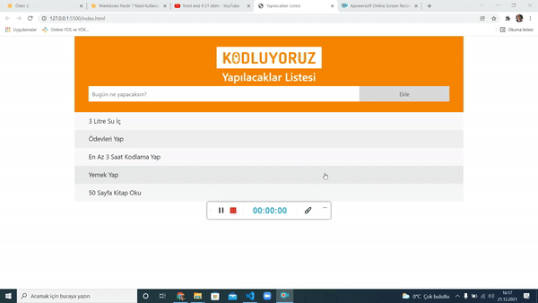
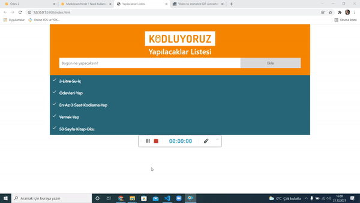

# To-Do List

## Listeye Eleman Ekleme

* Listeye eklenmek istenen değerler eklenebiliyor. 
* Ayrıca *"Listeye Eklendi"* uyarısı ekranda beliriyor ve çarpı (X) işaretine basıldığında bildirim ekrandan kayboluyor.

************************************

## Listeye Boş Karakter Ekleme

* Listeye boş karakter eklenmek istediğinde *"Listeye boş ekleme yapamazsınız!"* şeklinde bir uyarı ile karşılaşıyoruz. Çarpı (X) işaretine basıldığında uyarı ekrandan kayboluyor.

************************************

## Boş Karakter Eklemede **Hata**

* script.js klasöründe yer alan kod bloğu ileride geliştirilmek üzere o şekildedir. Bu bölüm için katkılarınızı bekliyorum :)

************************************

## Liste Elemanını İşaretleme

* İşaretlenmek istenen liste elemanına iki kere tıklanarak işlem gerçekleştirilebiliyor. 

************************************

## Liste Elemanının İşaretini Kaldırma

* İşaretlenmiş liste elemanının işareti liste elemanına 2 kere tıklandığında kaldırılabiliyor. Liste elemanı eski haline geliyor.

************************************

***İncelediğiniz için çok teşekkür ederim.*** 

***Katkılarınızı bekliyorum :)***